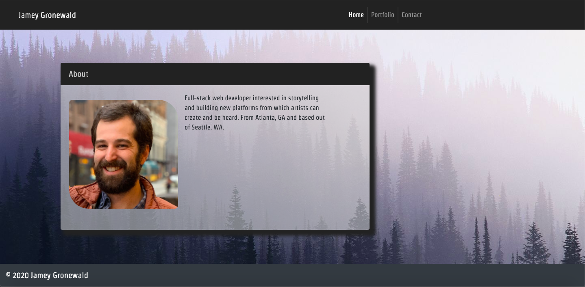
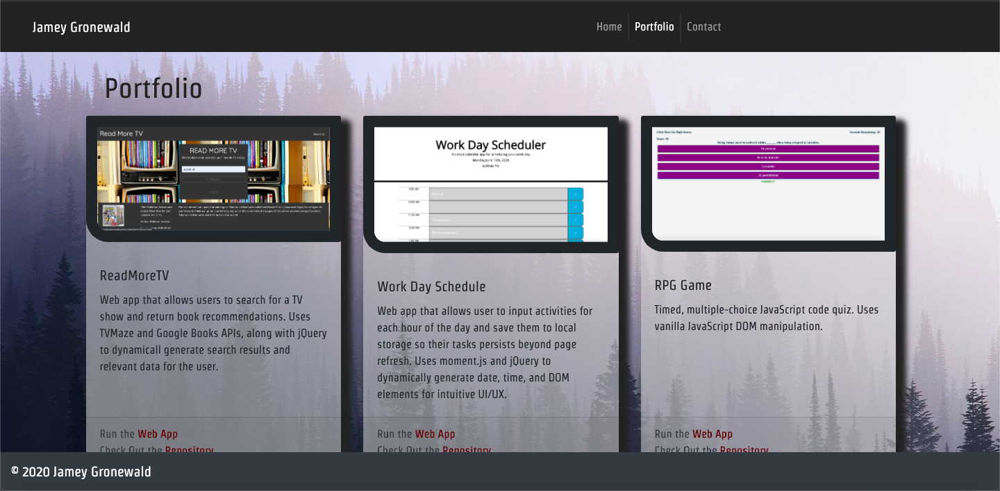
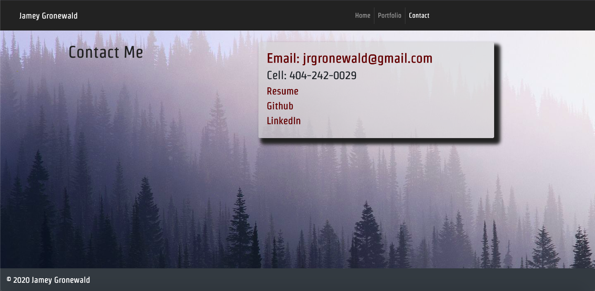

# React/Express Portfolio
Version of my portfolio built using React and Express.

---

## Description
This is my responsive portfolio built with React and served up via Express to Heroku. The app uses Bootstrap for a style library. 

The homepage provides my professional statement. The portfolio page provides descriptions and links for my projects. The contact page provides information for getting in touch with me and a link to my resume.

---

## Table of Contents

* [Installation](#Installation)
* [Usage](#Usage)
* [Images](#Images)
* [Credits](#Credits)
* [License](#License)

---

## Installation
1. Clone the Github Repository [here](https://github.com/jameygronewald/reactPortfolio).
2. Run ```npm install``` to install dependencies and then run ```npm start```

---

## Usage
* Visit the deployed app: [Jamey Gronewald Portfolio](https://stark-reaches-68505.herokuapp.com)

* Visit Github to track changes that were made or to clone the repo: [Github Repo](https://github.com/jameygronewald/reactPortfolio)

---

## Images





---

## Credits
I, Jamey Gronewald, was the sole contributor on this project.

---

## License

MIT License

Copyright (c) [2020] [Jamey Gronewald]

Permission is hereby granted, free of charge, to any person obtaining a copy of this software and associated documentation files (the "Software"), to deal in the Software without restriction, including without limitation the rights to use, copy, modify, merge, publish, distribute, sublicense, and/or sell copies of the Software, and to permit persons to whom the Software is furnished to do so, subject to the following conditions:

The above copyright notice and this permission notice shall be included in all copies or substantial portions of the Software.

THE SOFTWARE IS PROVIDED "AS IS", WITHOUT WARRANTY OF ANY KIND, EXPRESS OR IMPLIED, INCLUDING BUT NOT LIMITED TO THE WARRANTIES OF MERCHANTABILITY, FITNESS FOR A PARTICULAR PURPOSE AND NONINFRINGEMENT. IN NO EVENT SHALL THE AUTHORS OR COPYRIGHT HOLDERS BE LIABLE FOR ANY CLAIM, DAMAGES OR OTHER LIABILITY, WHETHER IN AN ACTION OF CONTRACT, TORT OR OTHERWISE, ARISING FROM, OUT OF OR IN CONNECTION WITH THE SOFTWARE OR THE USE OR OTHER DEALINGS IN THE SOFTWARE.